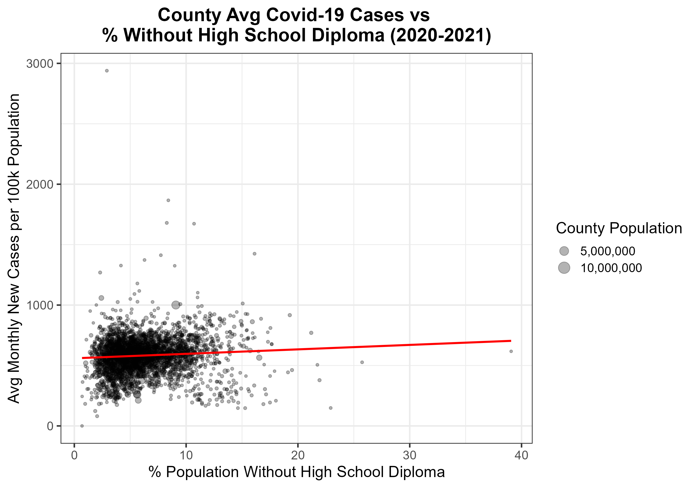

# Educational Attainment and COVID-19 Case Rates in U.S. Counties (2020–2021)

This project investigates whether there is a statistical relationship between educational attainment and Covid-19 infection rates at the county level in the United States during 2020–2021. Using county-level case data from the New York Times and educational data from the U.S. Census Bureau, I explored trends using time series analysis, normalization, and linear modeling in R.

---

## 📊 Key Questions

- Do counties with higher rates of adults holding bachelor’s degrees show lower COVID-19 infection rates per capita?
- Is there a positive correlation between low educational attainment and higher case rates?
- Do these trends vary regionally or by population size?

---

## 🧪 Hypothesis

I hypothesized that:
- Higher educational attainment correlates with lower COVID-19 infection rates per capita.
- Counties with lower high school completion rates would have higher case rates.

---

## 🗂 Project Structure
├── data/ # Instructions for accessing datasets (see README_data.md)
├── scripts/ # R scripts for data cleaning and analysis
├── output/ # Figures and final report (PDF)
├── README.md # Project overview
├── README_data.md # Dataset sources and licensing info
├── .gitignore # Ignore rules for sensitive or auto-generated files

---

## 📈 Visualizations

### Education vs. Average Monthly COVID-19 Cases

Counties with more adults holding bachelor's degrees tended to have lower average monthly COVID-19 case rates per 100k residents.

---

### No High School Diploma vs. Average Monthly Cases

A positive correlation was observed between lower educational attainment and higher infection rates.

---

### County Population vs. Average Monthly Cases

Larger population size did not appear to skew infection rates. In fact, larger counties showed slightly lower average case rates per capita.

---

### State-Level Correlation Index Choropleth

This choropleth map summarizes state-level trends by comparing correlations between education levels and COVID-19 case rates.

---

## 📑 Full Report

For detailed methodology, data preparation steps, and statistical modeling, see the full PDF report:

📄 [Download full report (PDF)](output/Education_and_Covid_19_Analysis.pdf)

---

## 📚 Data Sources

- **COVID-19 Case Data**: [The New York Times COVID-19 Dataset](https://github.com/nytimes/covid-19-data)
- **Educational Attainment Data**: [U.S. Census Bureau, ACS 5-Year Estimates (2020)](https://data.census.gov/)
  
For details, see [`README_data.md`](data/README_data.md).

---

## ⚙️ Tools Used

- R (tidyverse, ggplot2, usmap, sf)
- RStudio
- Linear modeling and time-series grouping
- Choropleth mapping

---

## 📌 Notes & Limitations

- New York City was removed as an extreme outlier that skewed analysis.
- Population density was not measured, but is a potential follow-up factor.
- County-level data was normalized per 100,000 residents to account for population size.

---

## 🧠 Lessons Learned

This project reinforced the importance of:
- Cleaning and aligning geographic data
- Handling outliers in public datasets
- Combining domain knowledge with statistical modeling